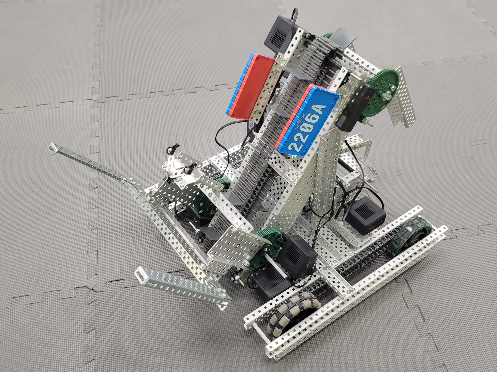

# Scorpio 1

Moderator: Carlos J. Cobian
Last Edited: March 2, 2022

Mechanical Team:
* Andres Juncos
* Mateo Ruiz
* Lorenzo Moreira

Programming Team:
* Luis Umpierre

 

## Design:

 

Scorpio was designed with the goal of optimizing the collection of rings while simultaneously moving around mobile goals efficiently. Its conveyor belt system allows it to quickly and efficiently pick up many rings in quick succession while also depositing them into a mobile goal. This goal is held up by the two mechanisms at the rear of the robot which hold the base steady from both the bottom and the top. The final piece of Scorpio's ring collection is its guiding ramp, located at the top of the conveyor belt, which allows the rings to fall onto the branch on the alliance mobile goal with more accuracy. Additionally, it has a forklift at the front which allows it to quickly pick up and move around mobile goals.

 

## Specifications:

 

### Mechanical Components:

 
<!-- Describe the motors, gear ratios, and gear cartridges -->
 

| Motor | Function |
|-------|-------------|
| Motor 10 | Base 18:1 |
| Motor 11 | Left Drivetrain 36:1 |
| Motor 12 | Right Drivetrain 36:1 |
| Motor 13 | Fishook 18:1 |
| Motor 15 | Treadmill 18:1 |
| Motor 16 | Rear 18:1 |
| Motor 17 | Fork 18:1 |

 

### Structural Components:

 
<!-- Describe the different apparatuses, parts, function -->
 

| Structure | Function |
|-------|-------------|
| Drivetrain | Move robot |
| Fishook | Grab a mobile goal alongside Rear |
| Treadmill | Move rings onto mobile goal |
| Rear | Grab a mobile goal alongside Fishook |
| Fork | Carry mobile goal |

 
